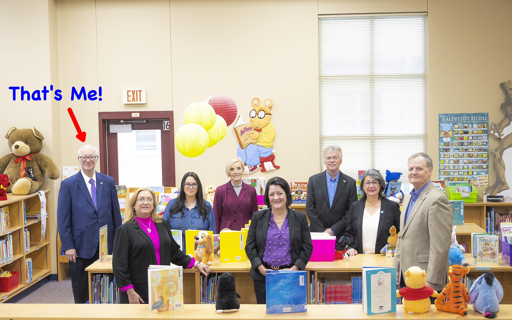

```{r, echo=FALSE}

flipdownr::flipdown(
  downto = "2025-06-02 23:59:59",
  id = "timer1",
  theme = "youkous",
  headings = c("Days", "Hours", "Minutes", "Seconds")
)

```
 
<br>

## *Time Until TX Legislature Puts (at least) One More Nail in the Coffin of Public Schools (Sine die-last day of session)*


<br>

## Education at the Crossroads:  Straight Talk for Very Troubled Times

It's hard to admit, but the current system of delivering K-12 education is in serious trouble. Public education today is on the verge of a slow collapse.  Sincere, honest folks doing their best, digging deeper the hole they are in.

Many of the problems come from attempts at centralized control by the state.  Continued unfunded mandates will certainly bring our public school systems crashing down. Yet, I hear no one advocating for ways to permanently end unfunded mandates (it is possible, you know).

A deeper problem is that education is a 'mature industry' - meaning it is very, very set in its ways.  Think of your last board training.  The main message was probably 'do what the state tells you' and 'stay in your lane.'

In a mature industry everyone does everything the same old ways.  It's even difficult to conceive of new perspectives.  The system itself never changes.  What educators today call 'innovation' is no more than rearranging the deck chairs on the Titantic -- **when a course change is the only thing that will save the passengers**.

It is also very hard for people to hear new ideas.  Imagination and leadership is required but is seldom rewarded in a mature industry.  Doing what everyone else does is easier.

Think about it: When was the last time you saw something provably improve learning?  Meanwhile, state government keeps adding rules while cutting funds, creating a perfect storm.

Here's the thing - when an industry gets stuck like this, solutions don't come from inside the system (sorry, TASB).  They come from people with a view from ***OUTSIDE*** the prevailing system.  From people who think differently because they can see the system clearly.  Who aren't trapped inside the system.

That's why I started this blog. It's an honest view from the outside.

Here you can share ideas that might seem outlandish to education insiders and challenge the status quo with honest perspectives.

Discuss what's really needed to save our public schools.

Generally, the blogs are short (3 - 5 minutes to read) ***but you won't be hearing these ideas anywhere else.***  They are not new, but they are new to most members of local school boards.

If you're tired of watching your education system slowly decline and ready for some outside-the-box thinking, you've found your home.  The discussion here might make you uncomfortable at times - good.  Local school boards must do some important things differently, or watch their beautiful district, that so many have devoted their lives to, disappear.

Here you can talk about all of it, and what we can do about it.

(If you are a flamer, find another blog - you won't last long here.)


<div style="text-align: center">
  {style="width:50%; height:auto; fontweight="}
</div>

<div style="text-align: center; font-size: 26;">
  Why are we here?
  <br>
  To LEARN and to have FUN!
</div>

\vspace{0.5in}


Now, Let's have some fun!

<br>

{width=80%}


\vspace{0.5in}
<br>

<div style="background-color: aliceblue; padding: 10px; border-left: 5px solid darkgreen;">

***Disclaimer:***

***This blog is not an official publication of the Schertz-Cibolo-Universal City ISD.  The contents are intended for informational and educational purposes only and does not represent the official position or policies of any school board or school district.  The views and opinions expressed do not reflect the official stance of any educational institution or governing body.  It is for those deeply concerned about the legislative 'machinery' that has become K-12 education in Texas, and the USA in general.   Any data presented is either synthetic to illustrate a point, or is public information found on the Texas Education Association website.  No effort has been made to ensure the accuracy of the information presented by those posting comments and the author assumes no responsibility for any errors or omissions, nor for any consequences arising from the use of this information.  Readers are encouraged to verify any information they may rely on.***

</div>

\vspace{0.5in}


